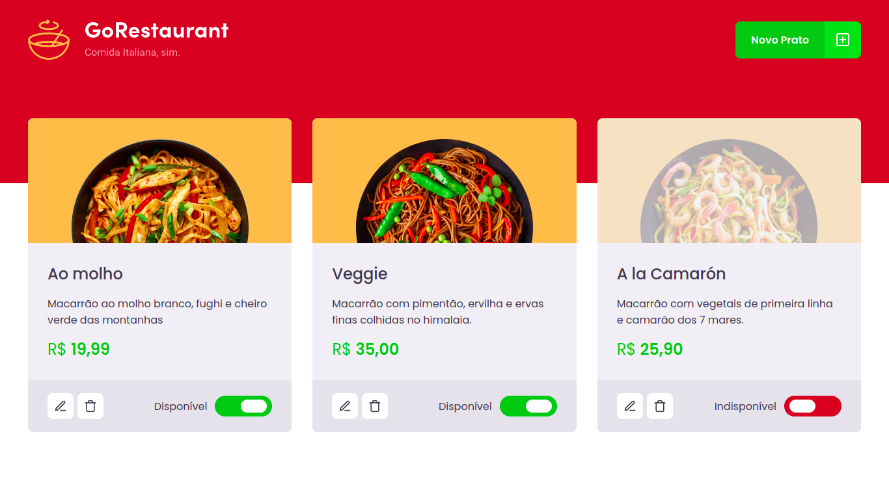

<h1 align="center" id="top">GoRestaurant</h1>

<p align="center">
  
  
  <a href="https://github.com/jtiagosantos/GoRestaurant/commits/master">
    
  </a>
  
   <a href="https://github.com/jtiagosantos/GoRestaurant/stargazers">
    
  </a>
</p>

<h4 align="center">
	🚧  GoRestaurant 🍕 Completed 🚀 🚧
</h4>

<p align="center">
  <a href="#-features">Features</a> •
  <a href="#-run-project">Run Project</a> •
  <a href="#-technologies">Technologies</a> •
  <a href="#-author">Author</a> •
  <a href="#-license">License</a> •
</p>

<br>

<h1 align="center">
    
</h1>

<hr />

## ⚙️ Features

- [x] See dishs
- [x] Edit dish
- [x] Delete dish
- [x] Add new dish (with image)  

<hr>

## 🚀 Run Project

1️⃣ Clone project and access its folder:

```bash
$ git clone https://github.com/jtiagosantos/GoRestaurant.git
$ cd GoRestaurant
```

2️⃣ Install dependencies:

```bash
$ yarn or npm i
```

3️⃣ Start project:

```bash
$ yarn server or npm run server
$ yarn dev or npm run dev
```

4️⃣ Run tests:

```bash
$ yarn test or npm test
```

<hr>

## 🛠 Technologies

The following tools were used in the construction of project:

- **[React](https://pt-br.reactjs.org/docs/getting-started.html)**
- **[Typescript](https://www.typescriptlang.org/)**
- **[Styled components](https://styled-components.com/)**
- **[Json-server](https://www.npmjs.com/package/json-server)**
- **[Jest](https://jestjs.io/pt-BR/)**
- **[Testing library](https://testing-library.com/docs/)**
- **[Axios-mock-adapater](https://www.npmjs.com/package/axios-mock-adapter)**
- **[Ts-jest](https://www.npmjs.com/package/ts-jest)**

<hr>

## 👨‍💻 Author


<strong><a href="https://github.com/jtiagosantos">Tiago Santos </a>🚀</strong>

[](https://www.linkedin.com/in/josetiagosantosdelima/)
[](mailto:tiago.santos@icomp.ufam.edu.br)

<hr>

## 📝 License

This project is under license [MIT](./LICENSE).


🔝 <a href="#top" align="center">Back to top</a>
